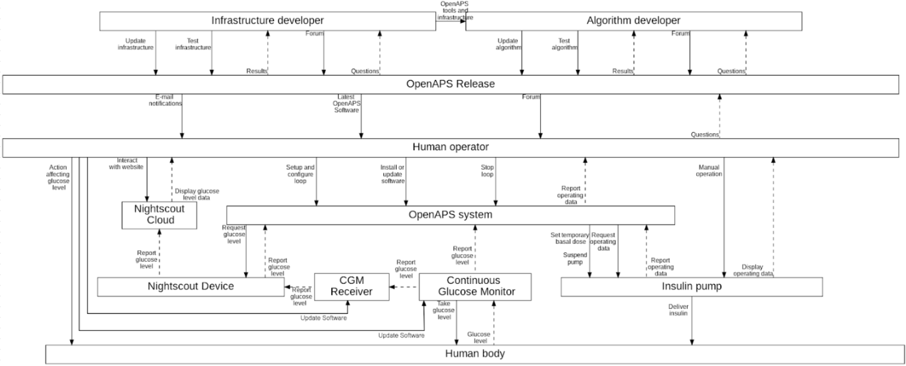
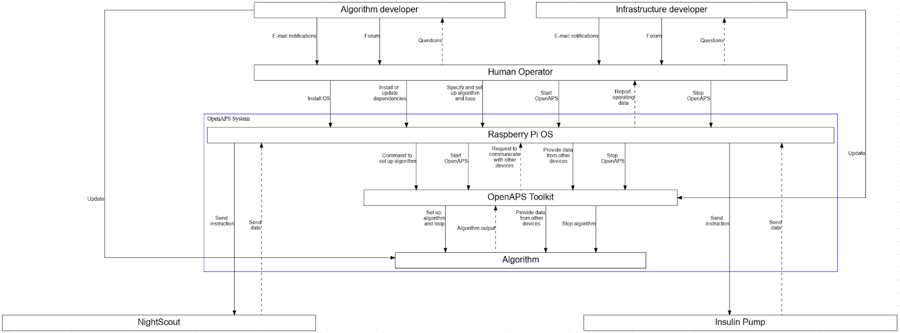

# wg-medical-devices
work area for analysis of medical devices

Document #1 - Applying STPA Document
* Goals
* References to useful STPA
* Learnings 

Document #2 openAPS Analysis
* see https://github.com/elisa-tech/wg-medical-devices/issues/9

Document #3 upstream Tracing Kernel Subsytems to Linux Kernel
* see https://github.com/elisa-tech/wg-medical-devices/issues/10

## Level 1 Control Diagram

## Level 2 Control Diagram

