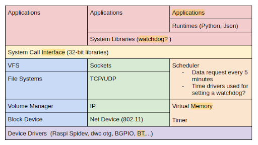

# Discovery Linux kernel subsystems used by openAPS

Discovering the Linux kernel subsystems in use by an application can be accomplished using Linux kernel features and commands. The goal is to gather the system state while the OpenAPS workload is running ro determine which parts of the kernel is being used.

The kernel system state can be analysed on a combination of static and dynamic features:

Static System View
- Supported system calls
- Static modules
- Dynamic modules
- Kernel Config options

Dynamic System View
- System calls invoked
- ioctls invoked
- Subsystems use

Let’s first look at the openAPS sources to understand the workload from a static view. The openAPS workload is a collection of: 

- Python libraries
- python-dev python-software-properties (which should be changed to software-properties-common),
- python-numpy
- Python-pip
- nodejs-legacy
- npm

One easier way to understand its runtime characteristics is watching system state while workload is running. We determined the following methodology and tools would work well for us to observe the system activity. 

## Methodology

- Discover Linux kernel subsystems used by openAPS
- Enable event tracing before starting the workload.
- Extract system call numbers from trace and map them to system calls
- Collect supported system calls using auditd package tool: ausyscall --dump
- Trace openAPS application (kernel tracing & strace)
- Gather static and dynamic module information

## Tools employed
- ausyscall --dump
- Kernel tracing
- lsmod
- scripts/checksyscalls.sh (Linux kernel script)

Our initial plan was to use strace, but we realized quickly that openAPS employs setup scripts to launch OpenAPS applications. As a result, using strace was not an option. We modified OpenAPS oref0-setup.sh in https://github.com/openaps/oref0.git to enable event tracing before openAPS starts its workload (processes, shell scripts)

==================================================================

diff --git a/bin/oref0-setup.sh b/bin/oref0-setup.sh
index 261da95b..5ae666e2 100755
--- a/bin/oref0-setup.sh
+++ b/bin/oref0-setup.sh
@@ -1269,6 +1269,11 @@ if prompt_yn "" N; then

 fi # from 'read -p "Continue? y/[N] " -r' after interactive setup is complete

+# ELISA enable event tracing
+echo "ELISA: Enable event tracing on all events"
+echo 1 > /sys/kernel/debug/tracing/events/enable
+cat /sys/kernel/debug/tracing/events/enable

==================================================================

We were able to gather traces with the above modification to oref0-setup.sh. We used ausyscall in System Administration Utilities:auditd

The ausyscall tool dumps out mapping for syscalls and their corresponding syscall table numbers. The mapping is architecture dependent for some system calls. The trace data includes NR followed by a number in the trace file. These are the syscalls that are run during the time the tracing was on.

Mapping the syscalls will tell us which system calls OpenAps is using. In addition we used scripts/checksyscalls.sh to check for system call support status on RasPi.

## Install necessary tools

### System call dump:
  sudo apt-get install auditd
  ausyscall --dump > syscalls_dump.out
### Supported system call check
  Linux kernel scripts: scripts/checksyscalls.sh

## What we did to gather traces and system state:

- Start openAPS workload with modified the modification to enable tracing
- Let the workload run for 30 minutes
- Discard last 5 minutes of trace from analysis to account for interferance (rsync and plugging devices) with trace file extraction
- Stop openAPS.
- Extract trace file from the system - cat /sys/kernel/debug/tracing/trace > trace.out
- Run lsmod after openAPS workload starts to gather module information

## Analyzing traces:
- Map the NR (syscal) numbers from the trace to the syscalls from the syscalls dump.
- Categorize system calls and map them to Linux subsystems.

## Findings and observations:
- ioctls in use are all spidev ioctls. OpenAPS python modules use spidev interfaces.
  - https://www.kernel.org/doc/Documentation/spi/spidev
  - https://pypi.org/project/spidev/
- Raspi SPI Dev and Python Spidev use (914 spidev ioctls invoked)
- CONFIG_SPI, SPI_BCM2835 options enabled.
- Heavy use of syscall32
  - Use scripts/checksyscalls.sh to check for support status

## Kernel module usage:

|Module Name|Usage count (OpenAPS)|Usage count (default)|
|-----------|---------------------|---------------------|
|cmac       |Not loaded           |1                    |
|ecdh_generic|1 (bluetooth)        |2 (bluetooth)        |
|ecc        |1 (ecdh_generic)     |1 (ecdh_generic)     |
|spidev     |2                    |Not loaded           |
|i2c_bcm2835|1                    |Not loaded           |
|spi_bcm2835|0                    |Not loaded           |
|i2c_dev    |2                    |Not loaded           |
|ipv6       |26                   |24                   |

## Subsystem usage

|Subsystem  |# of calls|
|-----------|----------|
|kmem_*     |200990    |
|mm_*       |182471    |
|sched_*    |195241    |
|rcu_*      |223011    |
|irq_*      |1781503   |
|kmalloc    |79801     |
|cpu_idle   |62623     |
|rss_stat   |22130     |
|ipi_*      |42514     |
|sys_*      |148034    |
|vm_*       |60489     |
|task_*     |72813     |
|timer_     |58572     |
|hrtimer_*  |152271    |
|softirq_*  |28860     |
|workqueue_*|6129      |
|writeback_*|3933      |
|ext4_*     |34461     |
|jbd2_*     |2062      |
|block_*    |3590      |
|dwc_otg*   |27701     |

## Updated system view

 

## Conclusion
This tracing activity was a good way of identifying which parts of the kernel are used by OpenAPS. This helped to generate the Updated system view, so it is useful for our goal to do an STPA analysis of OpenAPS Operating System activity. We plan to theoretically analyse how these different subsystems can interact unsafely, while using fault injection and mocked components to collect more traces.

#### This work is done under 65 with a disclaimer
